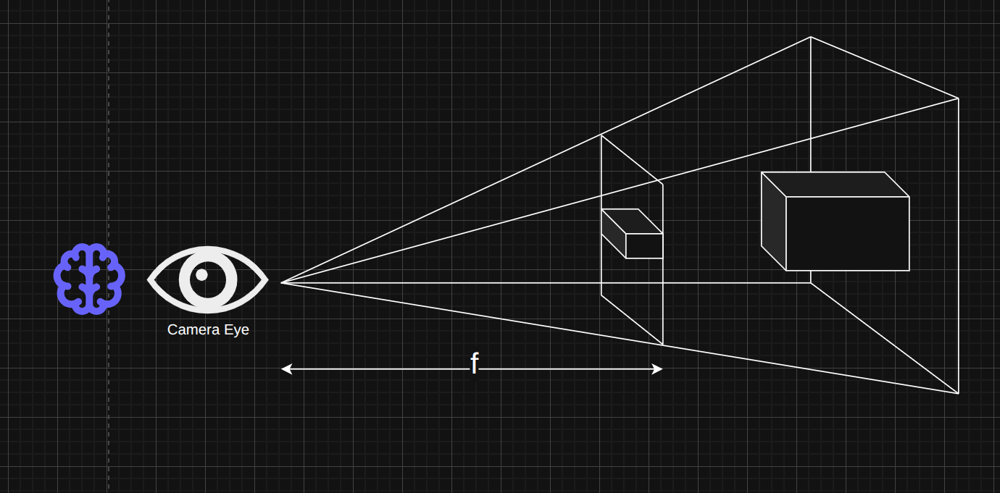
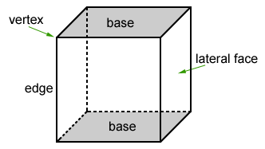
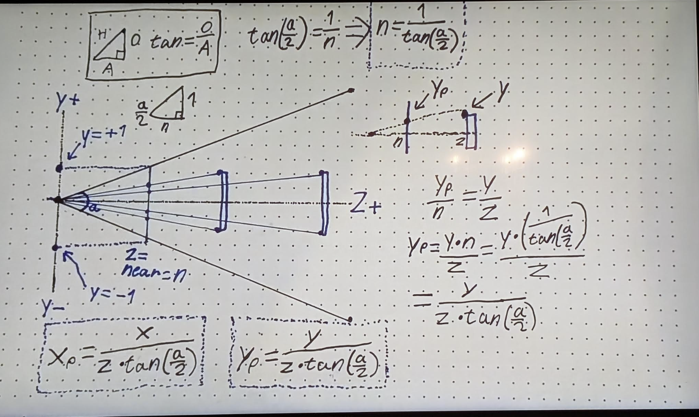
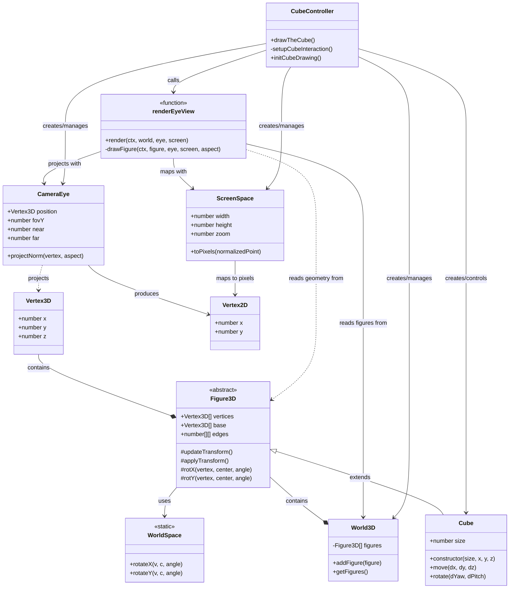
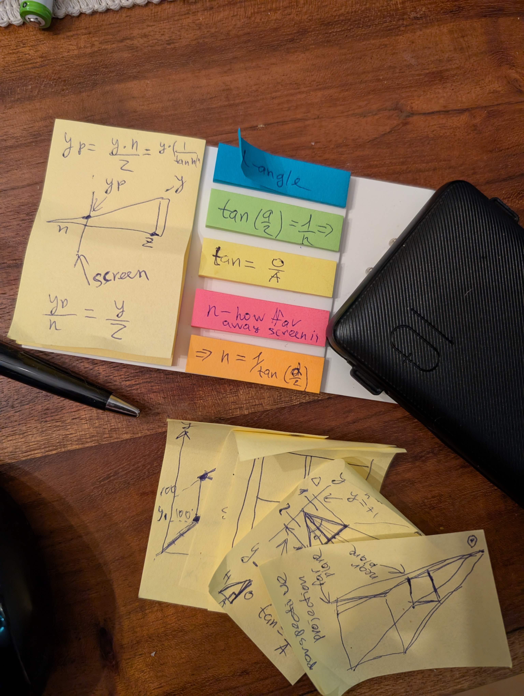

# A Moveable Feast - Screens of Reality

> How come we see 3D images on a flat screen, yet they still feel like real, solid objects?

This project is a practical exploration of perspective projection - the mathematical foundation behind 3D rendering. It implements a fully interactive 3D cube that you can rotate, zoom, and move to understand how we perceive depth on a 2D surface.

[The Train of Thoughts in Extra Dimension](https://sergiistarodubtsev.substack.com/p/the-train-of-thoughts-in-extra-dimension)

## The Concept: Perspective Projection

In reality, whether in movies, video games, or the real world, our eyes always project what we see onto a flat "screen" - the retina. We're actually seeing everything in 2D. The sense of depth comes later, when the brain reconstructs it from visual cues like perspective, shading, and the slight differences between what each eye sees.



This project demonstrates how this works in code through:

1. **Figure3D** - The base representation of 3D objects in world space
2. **CameraEye** - The observer that performs the projection to the 2D screen plane
3. **ScreenSpace** - The 2D surface where the 3D world is projected
4. **World3D** - The container for all objects and the camera



### The Math Behind It

The core of perspective projection is simple: objects appear smaller as they get farther away. The mathematical formula is:

```
Xp = X * n / Z
Yp = Y * n / Z
```

Where:
- (X, Y, Z) are coordinates in 3D world space
- (Xp, Yp) are the projected coordinates on the 2D screen
- n is the distance to the projection plane (near focus distance)
- n = 1 / tan(α/2), where α is the field of view angle



## Project Structure

The code is organized around these core abstractions:

```
src/
├── models/
│   ├── objects/
│   │   ├── 2d/             # 2D primitives (circle, line, rectangle)
│   │   └── 3d/             # 3D implementation
│   │       ├── camera-eye.ts    # The observer/camera
│   │       ├── cube.ts          # The 3D cube implementation
│   │       ├── figure-3d.ts     # Base class for 3D objects
│   │       ├── render-eye-view.ts # Rendering function decoupled from world
│   │       ├── screen-space.ts  # 2D projection surface
│   │       ├── world-3d.ts      # 3D world container
│   │       └── world-space.ts   # 3D transformation utilities
│   └── primitives/         # Basic geometry types
│       ├── vertex-2d.ts    # 2D point representation
│       └── vertex-3d.ts    # 3D point representation
├── controllers/
│   └── cube-controller.ts  # Handles cube interactivity
└── canvas.html            # Main entry point
```

### Architecture Diagram



### Decoupled Architecture Design

This project follows a clean separation of concerns between data, projection, and rendering:

1. **World3D** - Pure data container holding 3D figures without any knowledge of cameras or screens
2. **CameraEye** - Responsible only for projection calculations (world space to normalized device coordinates)
3. **ScreenSpace** - Handles mapping from normalized coordinates to actual pixels on screen
4. **Figure3D** - Contains 3D geometry data with no knowledge of rendering
5. **renderEyeView** - Decoupled rendering function that observes and draws the world

This strict separation ensures proper modeling of reality:
- Objects (figures) exist in space but don't know how they're seen
- The observer (eye/camera) determines how objects appear
- Rendering is the process of interpreting what the observer sees

This separation allows for greater flexibility, such as rendering the same world from multiple camera perspectives, or applying different rendering techniques without changing the world data.

## 🚀 Getting Started

### Prerequisites
- Node.js (v14 or later)
- npm (comes with Node.js)
- Any modern web browser

### Installation

1. Clone the repository:
   ```bash
   git clone https://github.com/starodubtsevconsulting/cube.git
   cd cube
   ```

2. Install dependencies:
   ```bash
   npm install
   ```

### Running the Project

To start the project, simply run:

```bash
./start.sh
```

This script will:
- Install dependencies if needed
- Compile TypeScript files
- Start a development server
- Open your browser automatically (you can opt out when prompted)
- Display helpful cube interaction instructions

You can also run with a clean build:
```bash
./start.sh --clean
```

### Interacting with the Cube

- **Rotate**: Click and drag to rotate the cube
- **Move**: Hold Shift while clicking and dragging to move the cube
- **Zoom**: Use the mouse wheel to zoom in and out

## Development

The project uses TypeScript with ES modules for a modern, type-safe development experience.

This project deliberately avoids using any web frameworks or complex build tools. It's built with vanilla JavaScript/TypeScript and uses a simple HTTP server only for development convenience (hot reloading). The focus is on the core concepts of 3D graphics rather than web technologies.

### Available Scripts

- `./start.sh` - Start the project (recommended way)
- `./stop.sh` - Stop all running services
- `npm run build` - Compile TypeScript to JavaScript
- `npm run watch` - Watch for file changes and recompile TypeScript files

## The Journey

This project began as an exploration to understand how 3D graphics work at a fundamental level. Instead of using existing 3D libraries, everything was built from scratch to truly understand the mathematics and concepts behind perspective projection.



As described in [A Moveable Feast - Screens of Reality](https://sergiistarodubtsev.substack.com/), the development process was an educational journey:

> After several hours of research over two days (I started with a line, then moved to 2D).
> Then I walked our the math - that is essential part - to figure out the equations for perspective projection.
> As project grew a bit, I switched to TS to take advantage of the type system.
> I built the core manually, without using AI (considering the historical context). Then, once the math was figured out and the abstractions took shape, I used some mechanical transformations with AI. I didn't want to cheat by not knowing what I was doing - the goal was to figure it out myself, old school.