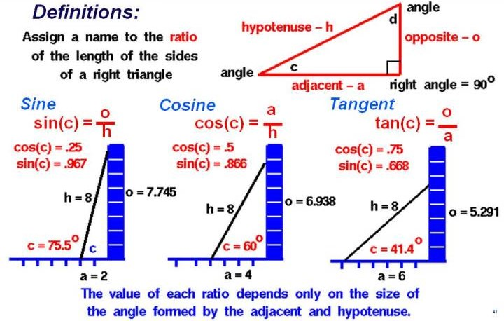
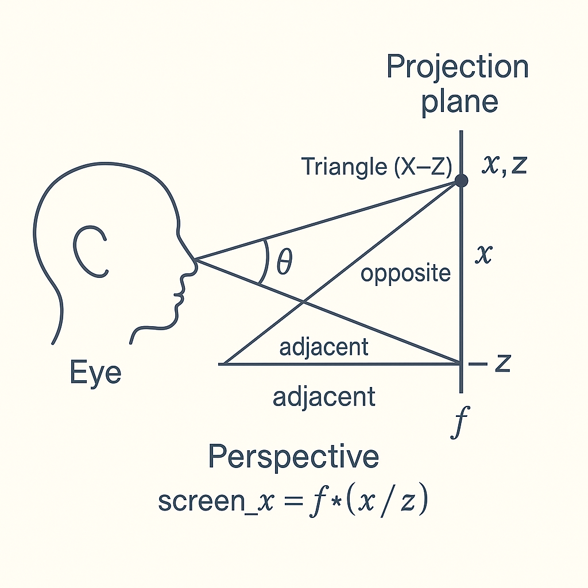

## Perspective in the Napkin Drawing

Here we see the 3d cube that is projected on the 2d paper plane.


In that napkin drawing:

is the classic right-handed coordinate system used in most math and in OpenGL.

- +X → right
- +Y → up
- +Z → into the screen/page (away from viewer)
- Camera by convention looks down the –Z axis so that objects in front of you have negative z in camera space.

You can keep +Z meaning “deeper” in world space, and then either:

- flip z in the view transform so objects in front have positive z for projection math, or
- keep them negative and account for that in your perspective formula.

It’s “classic” in the sense that most textbooks and graphics courses start with exactly this setup.

Notice :

- If a point in 3D has **x = 0, y = 0** (in world coordinates) and the camera is looking at it from an angle,  
it will project to some fixed point on the screen (e.g., the center at **50, 50** in normalized screen coordinates).

- The only reason we *see* the **Z** axis at all is because the camera is positioned so that Z is **not** pointing straight at us.  
If Z were exactly aligned with our line of sight, movement along Z would produce **no change** in screen position — so there would be no visible depth cues from projection.

- In that *straight-on* case, if the cube were perfectly aligned to the axes, it would project as a flat rectangle,  
and we couldn’t tell it had depth (assuming no shading, lighting, or parallax).

- In this drawing, the cube (or equivalently the view) is rotated about both the **X** and **Y** axes (≈ 45° in each),  
so we see three faces at once. This is why even a mathematically size-less point along the Z axis projects somewhere visible on screen,  
and why we perceive the third dimension.

## It is all about perspective, i.e., projection.

The events happen in 3D, but we perceive them in 2D. 
Almost 2D — because we can’t see every point in space at every moment, and our eyes only focus sharply on certain areas at a time.

When we look at a screen (which is something we do best), 
 the 2D plane shows itself in full — all depth is implied rather than physically present.
 To decide whether what we see in a picture feels truly 3D, we rely on our built-in imagination: 
 - if the image is accurate enough to show distant objects as small and far away (and near objects as large and close), our brain interprets it as a real 3D scene.

## And where exactly does the triangle come in?
The triangle represents the geometry between the eye, 
   the object, and the projection plane. 
   The ratios of its sides — especially the “opposite” over “adjacent” — are what give us the projection formulas. 
   Those ratios are why distant objects appear smaller and closer ones appear larger in perspective.


Let's look at the diagram below as class book "memo", 
 that is all about the "right triangle" and the angle.:



### Pay attention to **tan(θ) = opposite / adjacent**.

> In that ratio lies the key to how we look at the world in perspective:  
the *opposite* side represents how far a point is offset from the view center,  
while the *adjacent* side represents how far away it is.  

> The larger the ratio, the further from the center of the projection in the 2D image.

In other words,  
using the “wall” as an analogy —  
the one directly in front of us,  
where we focus our gaze  
and see the pixels on the plane or screen of the projected objects —  
and the distance to that wall (the focal length), we can say:

> To map a 3D point to the screen, we use **tan θ = o / a**,  
> where **o** is the offset along the axis on the “wall” (projection plane) in front of us,  
> and **a** is the distance from the viewer to that wall.

For example,
If you look straight ahead at the center of the wall:

 - The angle θ (in tan θ = o / a) is 0 because the opposite side 𝑜 o is 0 -  the point is exactly in line with your viewing direction.
   In other words:
- There’s no horizontal or vertical offset in camera space.
- The point is directly in front of you along the view axis.
- When projected, it lands exactly at the center of the screen — same place it would if you just “looked at it as is” with no shift.

As soon as we want to see things above or below that projection plane,
a shift occurs that we must calculate in order for our algorithm
to project the 3D point onto the 2D screen —
the same algorithm our eyes and brain use naturally.

`screen_y_offset==Oy/a`

- Oy -  (opposite) = vertical offset of the point from the center of view (in camera space)
- a -   (adjacent) =  distance from the viewer to the projection plane (focal length)


Let's look at the diagram with the person looking at the "screen" (his focus distance):

See the triangle we are talking about:



In that diagram (how to get x_screen):

- **Head/eye** → represents the viewer or the camera’s position (origin in 3D space).

- **Projection plane** → the “screen” where the 3D world gets flattened into 2D.

- **Point (x, y, z)** → a point in the 3D scene that we want to draw on the screen.

- **f** → **focal length**, the fixed distance from the eye to the projection plane.

- **x (on bottom)** → horizontal offset of the point from the view center in 3D space.

- **y (on right)** → vertical offset of the point from the view center in 3D space.

- **z → depth** — how far away the point is from the eye along the viewing direction.
--

You’re seeing two triangles that diagram is actually showing two related right triangles:

1. The main projection triangle (eye → point → projection plane)
2. A larger reference triangle (eye → “base” (looking straight ahead) of projection plane → projection plane)

in that diagram, the point being projected (x,z) is above the horizontal eye level.

The triangles in the picture are showing:

- Top: One triangle in the X–Z plane for computing horizontal position on the screen.

- Bottom:One triangle in the Y–Z plane for computing vertical position on the screen.

From these triangles we get the projection math:

```
screen_x = f * (x / z)
screen_y = f * (y / z)
That’s just tangent in action: tan(θ) = opposite / adjacent.
````

In the pure geometry view, 
 `f` is the distance from the eye (camera) to the projection plane (“the wall” in your analogy).


